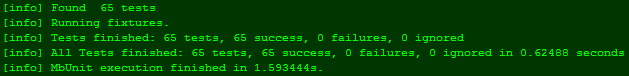

We have a steadily growing collection of small extension methods (including the usual `.IsNullOrEmpty()`, `.To<T>()`, etc.), along with corresponding unit tests, setup at my work. I spent some time a few weeks ago increasing the test coverage from around 70% to 100%, along with making the unit tests a bit more robust.

After setting up a build script for the project and adding it to our continuous integration server (which I'll blog about shortly), I found a few check-ins that were breaking old unit tests. Emails were automatically sent out, by the CI server, about the failed tests and broken builds, but it turns out too many of us were forgetting to run the unit tests before doing our check-in (obviously). We don't have [TestDriven.Net](http://www.testdriven.net/) or Resharper - though we'll likely be ordering copies of the later any day now - so we have no easy way of running the tests besides the standard MbUnit GUI. Yuck.

A few days later I ran into this helpful piece of information, I think perhaps from JP Boodhoo, though I'm not positive. Anyway, if you have a separate assembly for your unit tests, simply go to the property page of that project, click the "Build Events" tab along the left, and enter this in for the post-build event:

"$(ProjectDir)..\\UtilityLibrary.Core\\Internal\\Tools\\MbUnit\\MbUnit.Cons.exe" "$(TargetPath)"

This statement assumes you have your project checked out to something like C:\\MyProjects\\UtilityLibrary, and under there you have UtilityLibrary.Core for your actual code, and UtilityLibrary.UnitTests for, well, your unit tests. This command starts in the UnitTests forlder, goes up a directory (into C:\\MyProjects\\UtilityLibrary) and right back into the Core folder, which has the MbUnit library/program in it. If your situation is at all different, you'll have to adjust this command accordingly, but it's a good start.

Now your unit tests will be ran as a step in compiling your solution, and the compilation will fail if any of the unit tests fail:

Useful for smaller utility projects like this, but I imagine it'd become a pain in the ass for larger projects that take a bit of time to compile on there own, never mind having to run the unit tests on top of that every time. Sometimes you just want to see if the code compiles, not necessarily run all the tests too.
