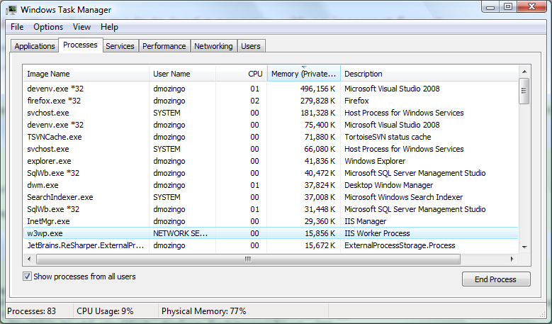
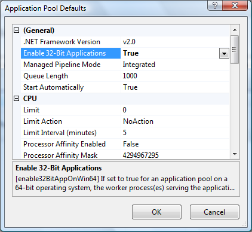
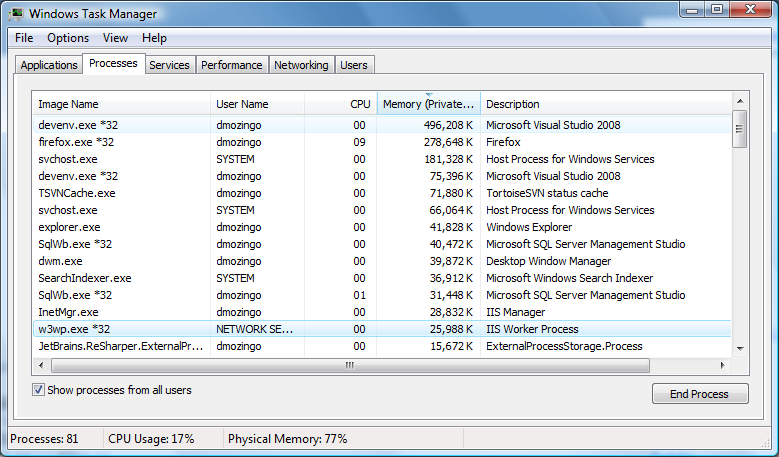

I recently got a new machine at work with a 64-bit quad-core CPU, dual 15k RPM SCSI drives, 4G RAM, and, \*gulp\*, Vista. I've never used Vista before, and after all the horror stories I've heard, I was pretty hesitant. We're using ASP.NET MVC with our new project, though, and deploying out to Windows Server 2008, which runs IIS7, so I figured developing with the same thing on my local box was a good idea. That means running the apps through IIS and not the built in Visual Studio 2008 Cassini server, which is what I was using back on XP.

So I set everything up, check out our project, fire up Visual Studio, hit debug, and BAM! I get a nice looking yellow screen of death, which, incidentally, isn't our application's start-up page. Here's the exception it throws:

**System.BadImageFormatException: Could not load file or assembly 'OurProject.Core' or one of its dependencies. An attempt was made to load a program with an incorrect format.**

WTF? It was working fine on my old box. I recompiled our app after changing all the projects to explicitly compile in 32-bit mode and still got the error. As it turns out, IIS will, by default, run in 64-bit mode on a 64-bit box. Makes sense. If you open Task Manager, you can see that's how it works (note there's no \*32 next to the process name like all the other 32-bit apps that are running, like Fire Fox and Visual Studio):

So how do you tell IIS 7 to run in 32-bit mode? I found a terribly helpful post [here](http://blogs.msdn.com/rakkimk/archive/2007/11/03/iis7-running-32-bit-and-64-bit-asp-net-versions-at-the-same-time-on-different-worker-processes.aspx) that details of the situation (both a fix and the reasoning behind it). Basically, go into your IIS 7 manager console, find the application pool your app is running in, right-click on it, go to `Advanced Settings`, and change the `Enable 32-bit Applications` setting to `true`:

Now restart IIS (either via the snap-in or the command line w/`net stop w3svc` & `net start w3svc`) and you're good to go. Easy enough, right? Pop open Task Manager again and you should see a lovely \*32 next to the World Wide Web Worker Process (w3wp.exe), signifying that it's basically running in 32-bit compatibility mode:

Hopefully your app should load fine now. Well, at least mine did.
