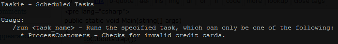

A little over a year ago I offhandedly mentioned the [scheduled task program](http://darrell.mozingo.net/2009/09/15/injecting-all-instances-of-a-given-type/) I wrote for one our products at work. Well, I'm finally releasing a stripped down version as open source.

**Taskie** is a super simple way to create and manage .NET scheduled task applications, built with dependency injection at its core.

## Why?

You're always going to need to do some kind of back-end processing in your apps, and you basically have two choices for them: a command line app, or a service. When it came time for that decision on our current project, we decided we never much cared for the deployment story with services (even with the awesomeness that [Topshelf](http://topshelf-project.com/) brings to the tableshelf), and our server geeks didn't like them much either for whatever reason. We're all used to console apps though, and they work, so we stuck with them.

But adding a new projecting to the solution for each scheduled task exe we needed? Parsing command line arguments? Not having dependency injection available? Having to deploy all that junk? No thanks!

So I whipped up Taskie. It handles all the boiler plate crud and eases deployment for us and the server geeks. Once you have it setup, whenever you need a new scheduled task you just slap in a class, implement a simple interface, and Taskie handles the rest.

## Getting Started

**UPDATE:** The first version I published wouldn't work if you were using StructureMap (as Taskie uses that internally). The assemblies linked below are now updated to work correctly in that situation.

1. Download the [Taskie assemblies](https://github.com/downloads/DarrellMozingo/Taskie/Taskie.dll)
2. Add a console application to your solution
3. Add a reference to `Taskie.dll` in the console application project, and set it to build against the full .NET 4.0 Framework (not the default Client Profile)
4. Implement `Taskie.ITaskieServiceLocator` in your application, using your dependency injection tool of choice. These methods should be single line implementations.
    
    public interface ITaskieServiceLocator
    {
    	INSTANCE GetInstance();
    	IEnumerable GetAllInstances();
    } 
    
5. Inside `Program.cs`, within your console application, initialize your dependency injection tool however you normally would and call `TaskieRunner.RunWith()`, passing the command line arguments and an instance of your implementation of `IServiceLocator`, like this:
    
    public static void Main(string\[\] args)
    {
    	IoC.Bootstrap();
    	TaskieRunner.RunWith(args, new ServiceLocator());
    }
    
6. Add a class that implements `Taskie.ITask` somewhere in your main project, name it "**Foo**Task" (where Foo is whatever you want, but it must end with Task), and make sure your dependency injection tool knows about it (either through auto discovery or explicity registered):
    
    public interface ITask
    {
    	void Run();
    }
    

That's it! Taskie is all setup and ready to roll. Running your console application with no command line arguments will show a usage screen listing any tasks that ready to run. Run the executable with "/run **Foo**" and it'll run whatever you have in the `Run` method on your `FooTask` class.

A few optional things you can do:

1. Tag your task class with the `TaskDescription` attribute, providing it a string description to display on the usage screen (as seen above)
2. Implement `Taskie.ITaskieApplication` to run any code before and after Taskie does its thing (such as setting up your NHibernate session)
    
    public interface ITaskieApplication
    {
    	void Startup();
    	void Shutdown();
    }
    

## Future Plans

A few of the things I'm thinking about for the future:

- NuGet package!
- ILMerge everything into one assembly file
- Create a way to schedule tasks on the server (either a fluent interface or through XML/text files), then have an MSBuild/NAnt/PowerShell/rake package that'll remotely set those scheduled tasks up
- Ability to log when tasks run & finish, along with a built-in task to ensure tasks are running when they should and can report when they don't (using the definitions mentioned above)
- Error reporting from tasks - emails, a pluggable interface, etc.
- An `ITransactionalTask` interface that provides a roll back method to cleanly implement that functionality when needed

Check out the [source code](https://github.com/DarrellMozingo/Taskie) on GitHub. A sample application is included.

This is my first open source project and first experience with Git, so please go easy on me :)

If you have any suggestions for anything (especially on how I can ease the getting started process), I'm all ears!
